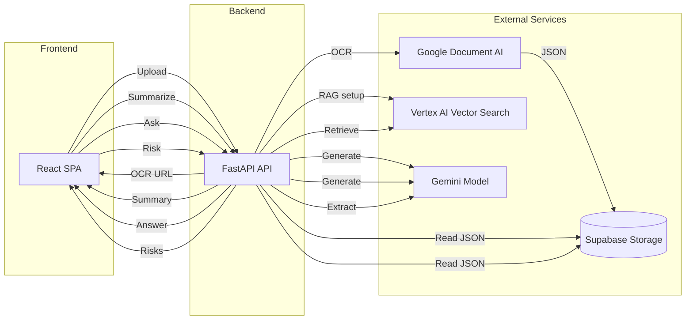
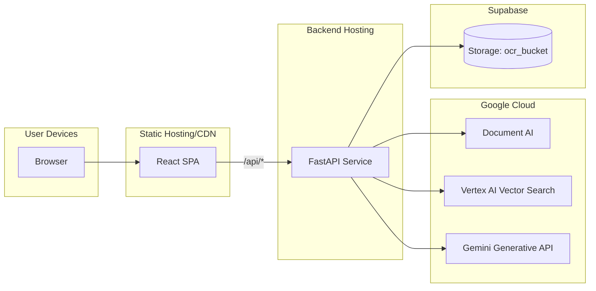

# DemystDocs.AI – Backend and Frontend

Full‑stack prototype for document OCR, summarization, risk extraction, and Q&A.

- Backend: FastAPI serving OCR (Google Document AI), Summarization (Gemini), Risk extraction (Gemini), and RAG Q&A (Vertex AI Vector Search + Gemini). Located in `backend/`.
- Frontend: React + Vite app consuming the backend. Located in `frontend/`.

## Repository structure
```
backend/
  routes/
    api.py                 # FastAPI app and endpoints
  lib/                     # OCR + RAG implementation
    ocr.py                 # Document AI OCR -> Supabase JSON
    get_summary.py         # Download + summarize with Gemini
    get_answer.py          # RAG Q&A using Vertex AI Vector Search
    get_risk.py            # Risk extraction using Gemini
    rag_builder.py         # Chunk, embed, and upsert to Vector Search
  requirements.txt         # Python dependencies
  *.json                   # Service account creds (example)

frontend/
  src/                     # React app (Vite)
  vite.config.js           # Dev proxy for /api
  package.json

docs/
  diagrams.md
```

## Prerequisites
- Python 3.10+ recommended
- Node.js 18+ (for the Vite frontend)
- Google Cloud project with the following APIs enabled:
  - Document AI API
  - Vertex AI API (for embeddings and Vector Search)
- Supabase project with a public storage bucket (default used by code: `ocr_bucket`)
- Gemini API key (google‑generativeai) – can be set as `GENAI_API_KEY` or `GOOGLE_API_KEY`
- A Google Cloud service account JSON with required roles (Document AI, Vertex AI) and `GOOGLE_APPLICATION_CREDENTIALS` pointing to it

## Backend – setup & run

From a PowerShell terminal (Windows pwsh):

1) Create and activate a virtual environment, then install dependencies

```powershell
cd backend
py -m venv .venv
.\.venv\Scripts\Activate.ps1
pip install -r requirements.txt
```

2) Create a `.env` file in `backend/` with required settings

```dotenv
# Google Cloud
PROJECT_ID=your-gcp-project-id
# Document AI location: "us" or "eu"
LOCATION=us
PROCESSOR_ID=your-document-ai-processor-id
# Service account file path (absolute or relative)
GOOGLE_APPLICATION_CREDENTIALS=./airy-strength-472009-q0-333fabafed6a.json

# Vertex AI Vector Search (required for Q&A/RAG)
VECTOR_SEARCH_INDEX_ID=projects/your-project/locations/us-central1/indexes/INDEX_ID
VECTOR_SEARCH_ENDPOINT_ID=projects/your-project/locations/us-central1/indexEndpoints/ENDPOINT_ID
DEPLOYED_INDEX_ID=DEPLOYED_INDEX_ID

# Supabase (storage bucket must exist and be public, e.g., ocr_bucket)
SUPABASE_URL=https://YOUR-PROJECT.supabase.co
SUPABASE_KEY=YOUR-SERVICE-ROLE-OR-ANON-KEY
SUPABASE_BUCKET=ocr_bucket

# Gemini API key – either of these are used by different modules
GENAI_API_KEY=YOUR-GEMINI-API-KEY
GOOGLE_API_KEY=YOUR-GEMINI-API-KEY
```

Notes:
- Document AI uses `LOCATION` (values like `us`/`eu`). Vertex AI code currently sets `LOCATION = "us-central1"` internally.
- Ensure the service account has permissions for Document AI processors and Vertex AI resources.
- The Supabase bucket should allow public reads (or adjust code to use signed URLs).

3) Run the FastAPI dev server

```powershell
uvicorn routes.api:app --host 0.0.0.0 --port 8000 --reload
```

Then open Swagger UI at: http://localhost:8000/docs

### Backend endpoints (current)

- GET `/` – Welcome + links
- GET `/health` – Health check `{ "status": "ok" }`
- POST `/get_ocr` – multipart/form-data upload: `file`. Returns `{ "url": "<public supabase json url>" }`.
- POST `/get_summary` – Provide the OCR JSON file path via either:
  - Query: `?file_path=ocr/<uuid>.json` or the full public URL, or
  - JSON body: `{ "file_path": "ocr/<uuid>.json" }`
  - Response: `{ "summary": "..." }`
- POST `/ask` – Q&A on the document using Vector Search context
  - Query or JSON: `question`, `file_path` (same rules as above)
  - Response: `{ "response": "..." }`
- POST `/get_risk` – Extract risky statements
  - Query or JSON: `file_path`
  - Response: `{ "risk_statment": [ { "statement": str, "explanation": str }, ... ] }`

Important:
- `/ask` requires the document to be chunked/embedded and upserted to your Vertex AI Vector Search index. The first call to `/get_summary` triggers `create_rag(...)` in the background for the given file so the next Q&A runs with context.

## Frontend – setup & run

1) Install and start the Vite dev server

```powershell
cd frontend
npm install
npm run dev
```

2) Configure Firebase (optional: used for auth/profiles)

Create `frontend/.env.local` with your Firebase config:

```dotenv
VITE_FIREBASE_API_KEY=...
VITE_FIREBASE_AUTH_DOMAIN=...
VITE_FIREBASE_PROJECT_ID=...
VITE_FIREBASE_STORAGE_BUCKET=...
VITE_FIREBASE_MESSAGING_SENDER_ID=...
VITE_FIREBASE_APP_ID=...
VITE_FIREBASE_MEASUREMENT_ID=...
```

3) API proxy during local dev

The frontend calls `/api/...`. Dev proxy is configured in `vite.config.js`.

- To use your local backend, set the proxy target to `http://localhost:8000`:
  ```js
  // vite.config.js
  export default defineConfig({
    server: {
      proxy: {
        '/api': {
          target: 'http://localhost:8000',
          changeOrigin: true,
          secure: false,
          rewrite: (p) => p.replace(/^\/api/, ''),
        },
      },
    },
  })
  ```
- The committed config points to a hosted backend. Change it for local testing.

## Troubleshooting
- Document AI errors: verify `PROJECT_ID`, `LOCATION`, `PROCESSOR_ID`, and that the processor exists and the service account has access.
- Vertex AI Q&A returns empty/irrelevant answers: ensure Vector Search index/endpoint are created and `VECTOR_SEARCH_*` IDs are correct; confirm the document was embedded (triggered by `/get_summary`).
- Supabase download/upload failures: confirm `SUPABASE_*` values and the bucket name (default `ocr_bucket`) and permissions.
- CORS issues: CORS is currently permissive in the backend (`allow_origins=["*"]`).

## Diagrams
See `docs/diagrams.md` for the full set. Key diagrams inline below.

### High-level process flow



### Deployment topology


