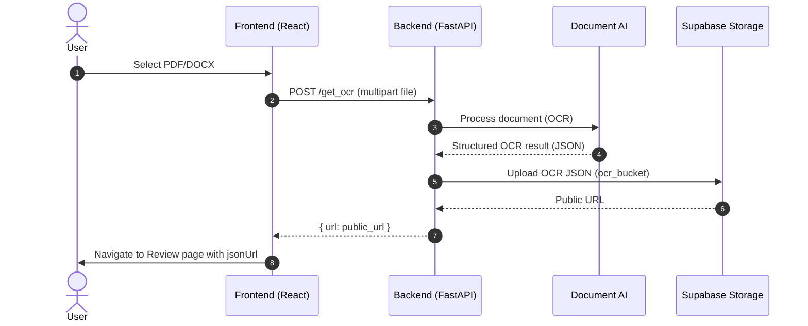
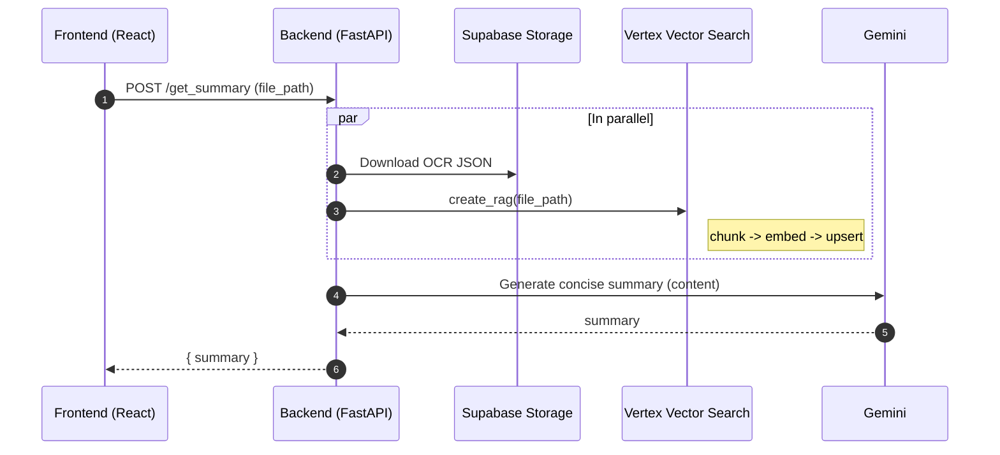
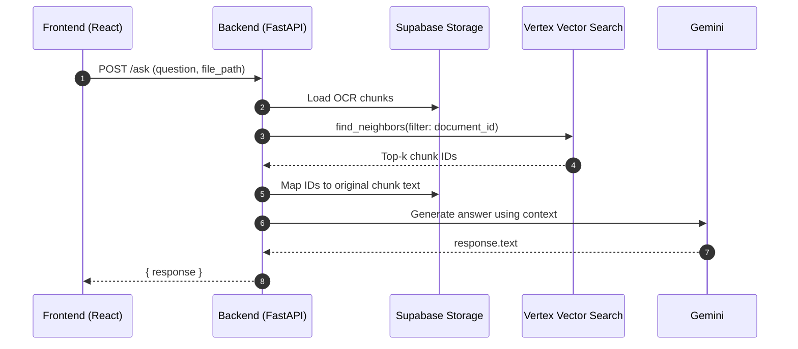
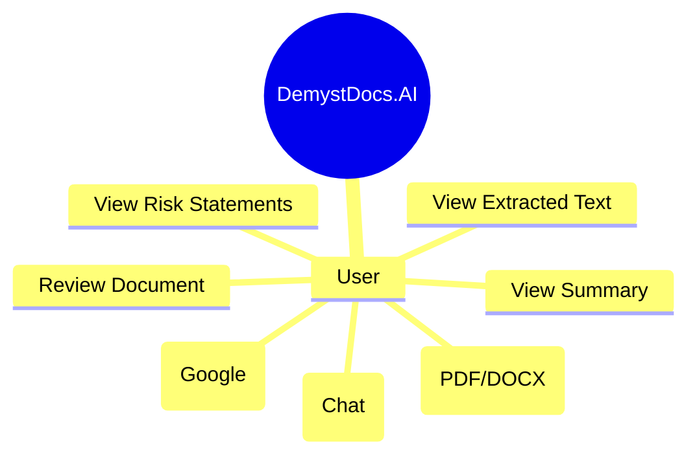

# DemystDocs.AI – Diagrams

This page documents the system at a glance. All diagrams use Mermaid, which GitHub renders inline.

## High-level process flow

```mermaid
flowchart TB
  user[User] -->|Login / Signup| fe[React Frontend]
  user -->|Upload PDF/DOCX| fe

  fe -->|POST /get_ocr (file)| be[FastAPI Backend]
  be -->|Process file| docai[Google Document AI]
  docai -->|OCR JSON| sb[(Supabase Storage: ocr_bucket)]
  be -->|Return public JSON URL| fe

  %% Summary flow
  fe -->|POST /get_summary (file_path)| be
  be -->|Download OCR JSON| sb
  be -->|create_rag: chunk → embed → upsert| vs[Vertex AI Vector Search]
  be -->|Summarize| gemini[Gemini (Generative AI)]
  gemini --> be --> fe

  %% Q&A flow (RAG)
  fe -->|POST /ask (question,file_path)| be
  be -->|Load chunks| sb
  be -->|Find neighbors (filtered by document_id)| vs
  be -->|Generate answer with context| gemini
  gemini --> be --> fe

  %% Risk extraction
  fe -->|POST /get_risk (file_path)| be
  be -->|Load OCR text| sb
  be -->|Extract risks| gemini
  gemini --> be --> fe
```

## Sequence – Upload & OCR



## Sequence – Summarize



## Sequence – Ask a question (RAG)



## Use cases (mindmap)



## Actors and components

- User: interacts via web UI
- Frontend: React + Vite app, routes for login, signup, upload, review
- Backend: FastAPI with endpoints
  - POST /get_ocr
  - POST /get_summary
  - POST /ask
  - POST /get_risk
- External services
  - Google Document AI (OCR)
  - Vertex AI: Text Embeddings + Matching Engine (Vector Search)
  - Gemini (Generative answers and summarization)
  - Supabase Storage (stores OCR JSON)
