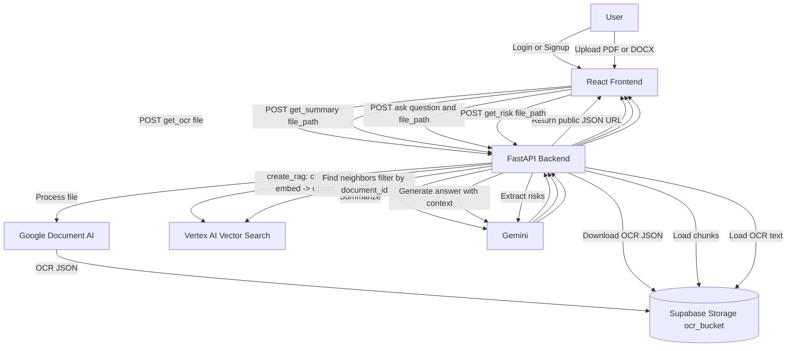
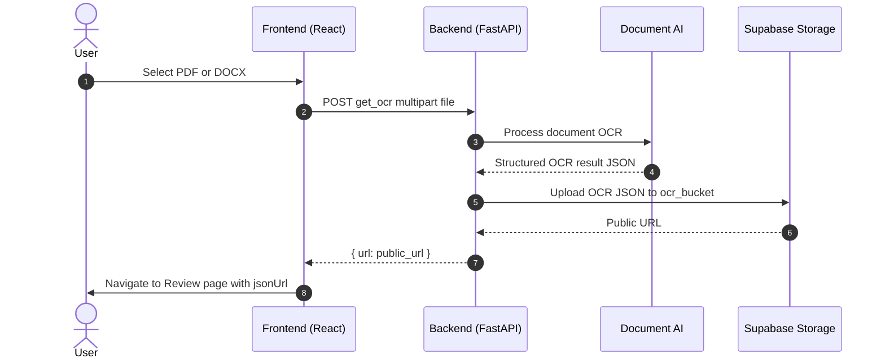
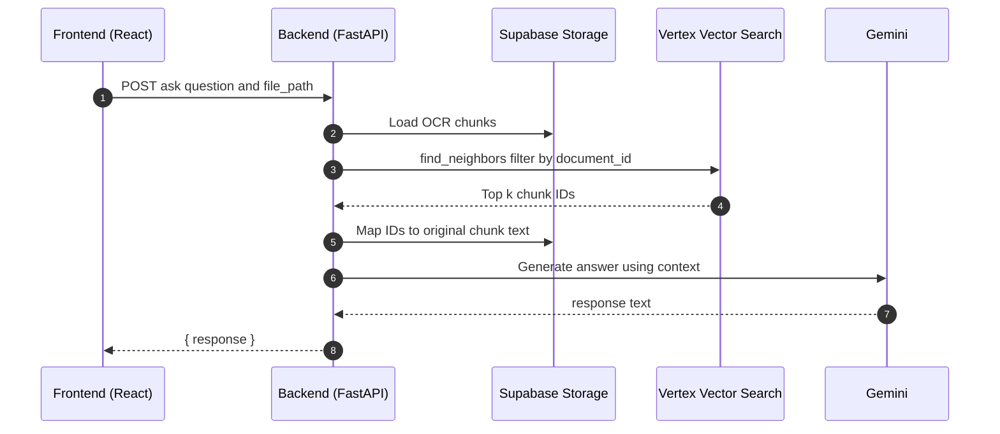
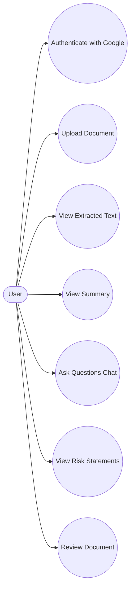

# DemystDocs.AI – Diagrams

This page documents the system at a glance. All diagrams use Mermaid (GitHub-compatible syntax).

## High-level process flow

## Sequence – Upload and OCR

## Sequence – Summarize

## Sequence – Ask a question (RAG)

## Use cases

## Actors and components

- User: interacts via web UI
- Frontend: React + Vite app, routes for login, signup, upload, review
- Backend: FastAPI with endpoints
  - POST /get_ocr
  - POST /get_summary
  - POST /ask
  - POST /get_risk
- External services
  - Google Document AI (OCR)
  - Vertex AI: Text Embeddings + Matching Engine (Vector Search)
  - Gemini (Generative answers and summarization)
  - Supabase Storage (stores OCR JSON)
