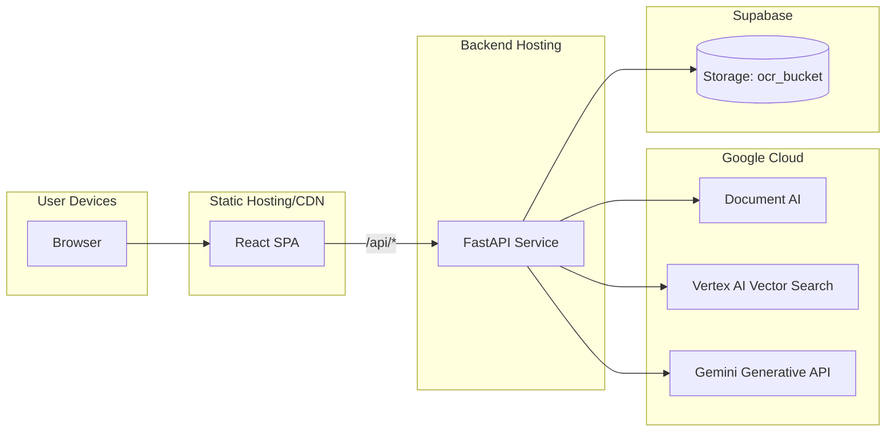
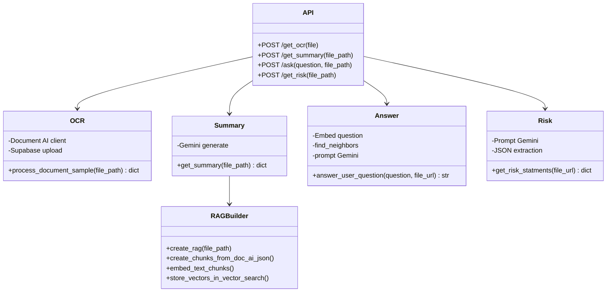
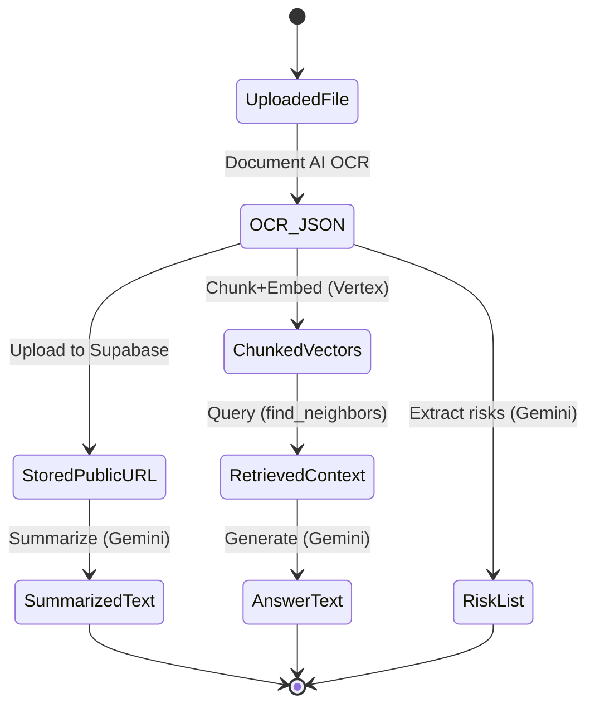
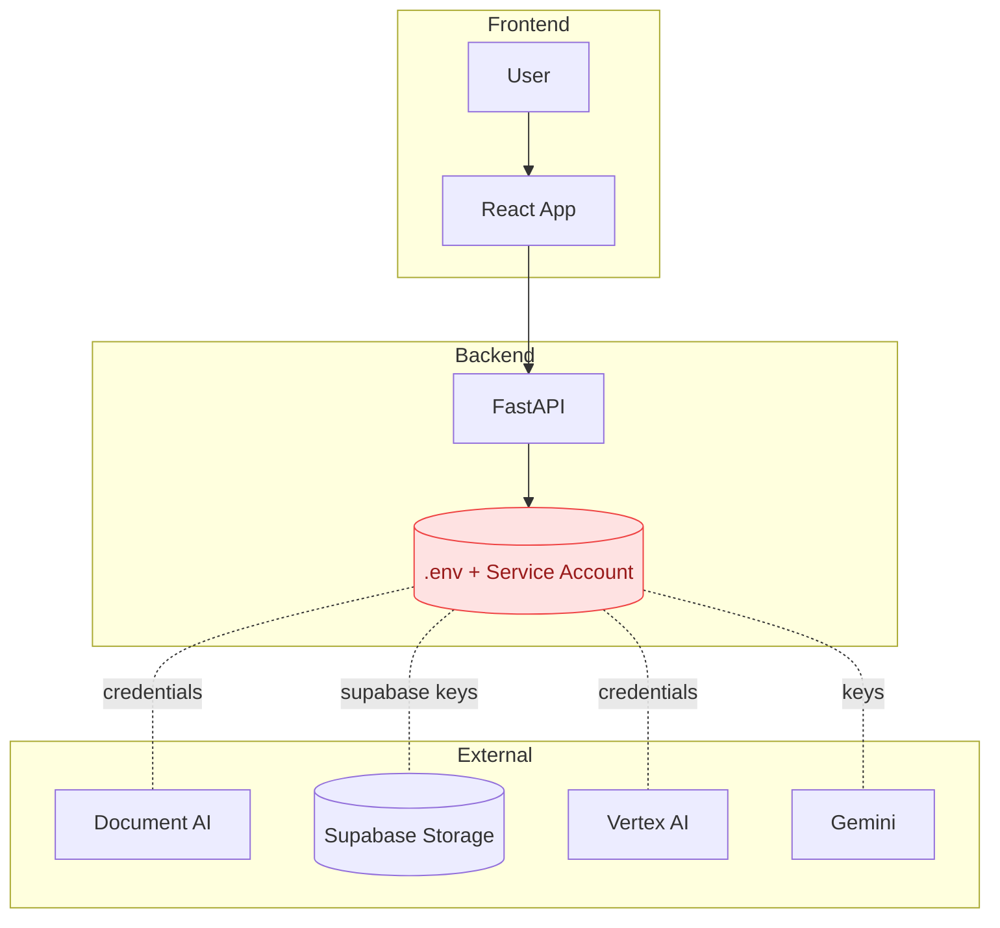

# DemystDocs.AI – Diagrams

This page documents the system at a glance. All diagrams use Mermaid (GitHub-compatible syntax).

## High-level process flow

## Architectural flow diagram

Notes
- In development, the Vite proxy forwards requests from path api to the backend. In production, the SPA can call the backend directly.
- Supabase stores OCR JSON outputs produced by Document AI.
- Vertex Vector Search stores document chunks as vectors for retrieval augmented generation.
- Gemini is used for summarization, Q and A, and risk extraction prompts.

## Use case diagram – detailed

### Use case notes

- Authenticate: Google Sign-In via Firebase on the frontend; session state drives access to upload and review.
- Upload Document: User selects PDF or DOCX; sent to backend for OCR.
- Extract OCR and Store: Backend runs Document AI, stores JSON in Supabase, returns public URL.
- View Extracted Text: Frontend loads OCR JSON and renders text overlay.
- Summarize Document: Backend downloads OCR JSON, runs RAG setup, summarizes via Gemini.
- Ask Questions: Backend embeds question, retrieves context via Vertex Vector Search, answers with Gemini.
- Risk Extraction: Backend prompts Gemini to extract risky statements with strict JSON output.
- Review Document: Combined view of extracted text, summary, Q and A, and risks.

## Sequence – Upload and OCR

## Sequence – Summarize

## Sequence – Ask a question (RAG)

## Process diagrams – endpoint specifics

### Process: get_ocr

### Process: get_summary

### Process: ask

### Process: get_risk

## Actors and components

- User: interacts via web UI
- Frontend: React and Vite app, routes for login, signup, upload, review
- Backend: FastAPI with endpoints
  - POST /get_ocr
  - POST /get_summary
  - POST /ask
  - POST /get_risk
- External services
  - Google Document AI for OCR
  - Vertex AI Text Embeddings and Matching Engine for vector search
  - Gemini for summarization, Q and A, and risk extraction
  - Supabase Storage for OCR JSON

---

## Deployment topology

## Backend components

## Data lifecycle

## Security & secrets flow

